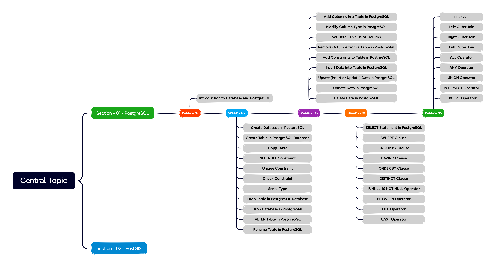

# Database

This repository is **_Database_** course for bachelor students that I am teaching assistant in Winter 2025 at the  [University of Noshirvani, Babol](https://nit.ac.ir/en).

This course will be focus on the `PostgreSQL and PostGIS`. The course schedule is as follows:

---

## Table of Course Content

---

## References
